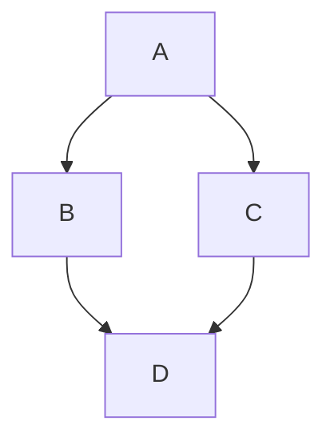
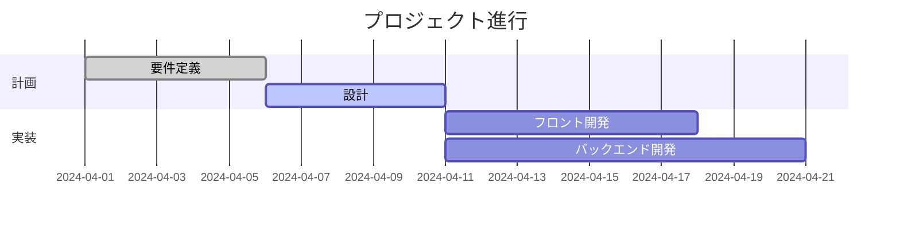
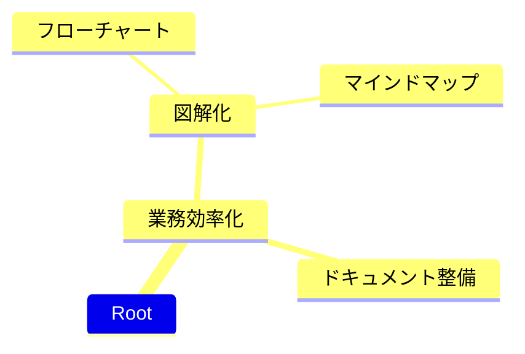
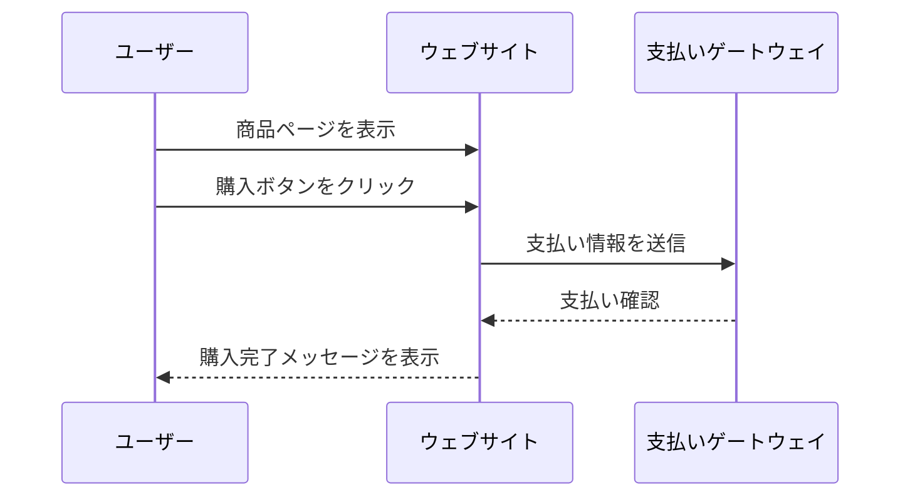
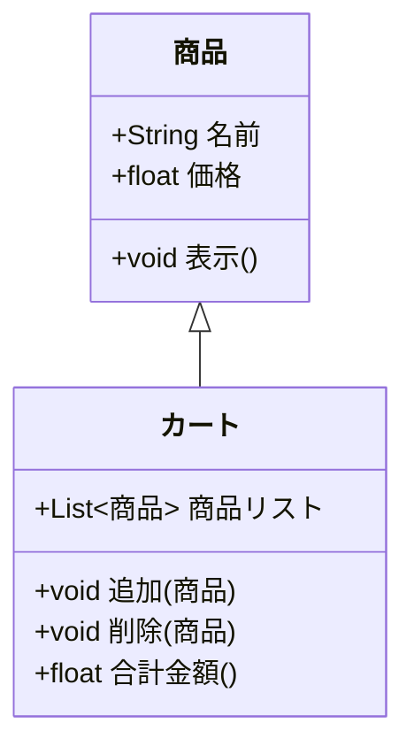

# 段落1  
  
## 段落2  
  
### 段落3  
  
#### 段落4  
  
- 箇条書き  
  - 箇条書き  
  
1. 英数字箇条書き  
  a. 英数字箇条書き  
  
見出しとアンカー  
  
- [段落1](#段落1)  
  - [段落2](#段落2)  
    - [段落3](#段落3)  
      - [段落4](#段落4)  
  
~~打消し~~  
  
**太字**  
  
*斜体*  
  
仕切りの水平線  
  
***  

引用文
> 引用文
  
表  
  
| 見出し1 | 見出し2 | 見出し3 |
|--------|--------|--------|
| セル1   | セル2   | セル3   |
| セル4   | セル5   | セル6   |
  
インラインコード  
  
`ls -la`  
  
コードブロック  
  
```JAVA
// 世界に挨拶
System.out.println("Hello, World!");
```  
  
リンク  
  
[d払い](https://www.docomo.ne.jp/service/d_payment/)  
  
画像  
  
  

付箋ペタペタ

> [!NOTE]
> ノート
  
> [!TIP]
> コツ
  
> [!WARNING]
> 注意！
  
> [!IMPORTANT]
> 重要！
  
> [!ERROR]
> エラー！
  
mermaidグラフ  
  

  
応用編(ガントチャート)
  

  
応用編(マインドマップ)  
  

  
応用編(シーケンス図)
  

  
応用編(UML/クラス図)

  
UI(チェックボックス)  
- [x] やった  
- [ ] やってない

# 1on1_20260707

## 樋渡さん

### 質問0
- もうすぐ案件開始から1年になります。継続への意欲はどのくらいありますか？(5段階)
  - [ ] しんどい。。今すぐ退prjしたい
  - [ ] できれば他の案件に移動したい
  - [ ] 続くなら継続したいが、絶対ではない
  - [x] 充実しており、ぜひ継続したい
    - AL2023対応等でAWSの実業務に触れることができる 
  - [ ] 絶対続けたい！

### 質問1
- 今困っていることはありますか？
  - 特にない！

### 質問2
- 最近挑戦したことや熱中していることなどはありますか？
  - AIに興味はあるが挑戦には至っていない 

### 質問3
- Markdown記法は使用してますでしょうか？(Confluence等で使用可能です。このドキュメントもmdです)
  - 進捗なし。使用意欲はある(Confluenceに慣れていない・・・)
    - ショートカット的に使ってほしい・・・by 田中  

### 質問4
- AI活用が進むにつれて倫理的・セキュリティ的なところも問題になってくると思います。例えばどのような問題がありそうでしょうか(例:社内機密をAIに聞いてしまう)
  - 組織的な情報を学習されてしまう。(1度学習されると消せない)
    - AIを使う人に研修を受けさせて注意喚起を行う  

### 質問5(思い付き)
- おすすめの旅行先はありますか。円安なので国内がいいです・・・
  - 鹿児島がおすすめ！

---

## 押切さん

### 質問0
- もうすぐ案件開始から1年になります。継続への意欲はどのくらいありますか？(5段階)
  - [ ] しんどい。。今すぐ退prjしたい
  - [ ] できれば他の案件に移動したい
  - [ ] 続くなら継続したいが、絶対ではない
  - [x] 充実しており、ぜひ継続したい
  - [ ] 絶対続けたい！

### 質問1
- 今困っていることはありますか？
  - 全くない！

### 質問2
- 最近の稼働が高そうに見えてます。休憩できていますか？
  - 6月は稼働が高めでした。一旦は落ち着きそうです・・・ 

### 質問3’
- 生成AIが作ったプログラムの責任分解点はどこになるとお考えですか？
  - 人が見ている。見た人の責任が重そう(作成段階ではそう) 

### 質問4’
- 生成AIが体を持つ(ロボットに組み込まれる)と言われています。脅威に感じますか？それとも機会を感じますか？
  - ものによる。物理的な物でも脅威はあまり感じない・・・。車は怖い。。 

### 質問5(思い付き)
- 円安でクラウドからオンプレミスへの巻き戻しは起きると思いますか？
  - 円高になった時に戻るのか？・・・たぶん、余程の事が無いと起きないかなと

  
