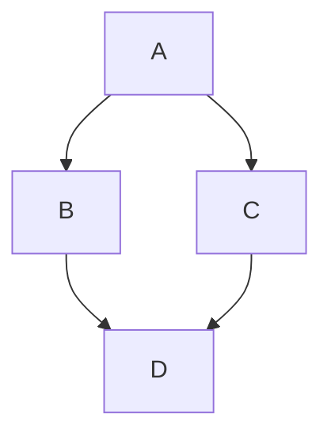
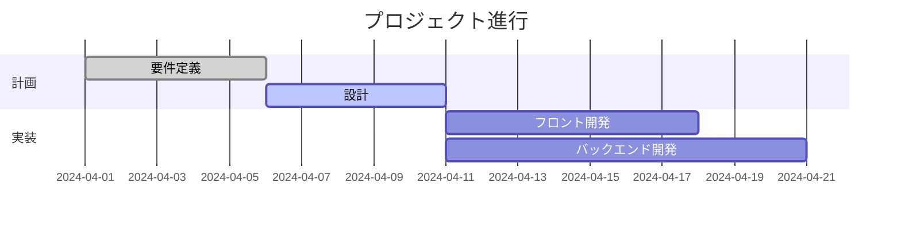
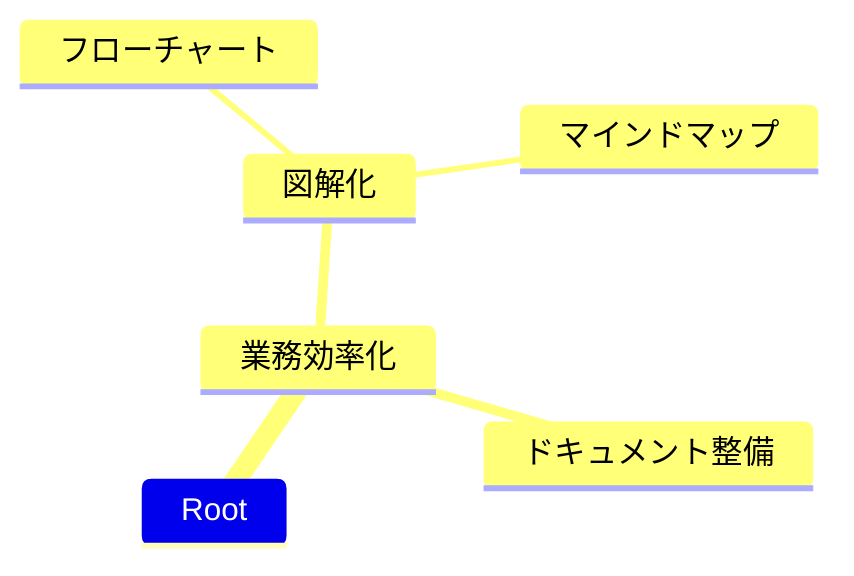
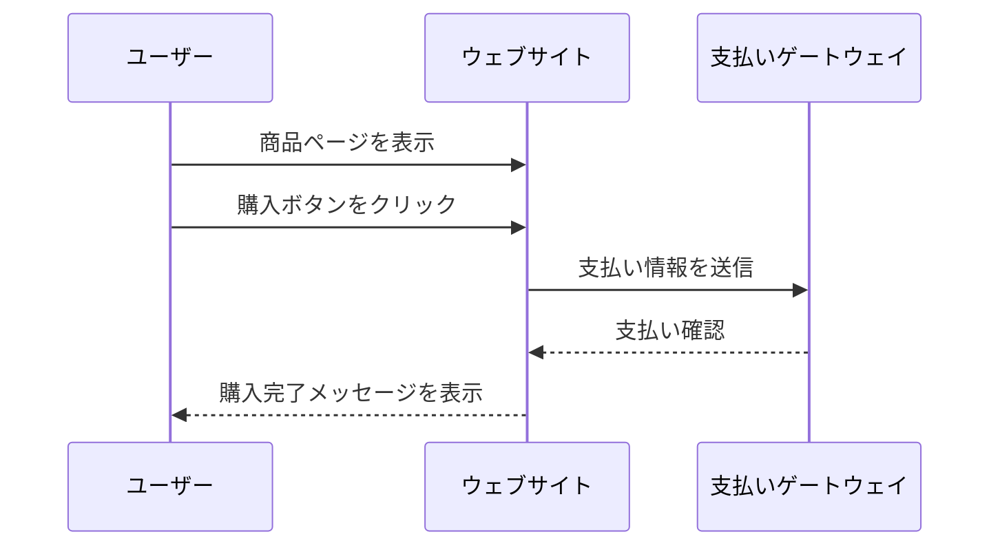
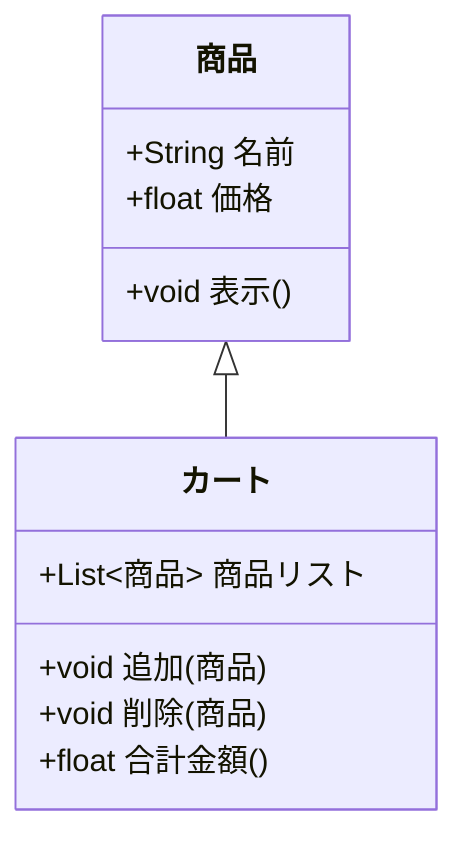

# 段落1  
  
## 段落2  
  
### 段落3  
  
#### 段落4  
  
- 箇条書き  
  - 箇条書き  
  
1. 英数字箇条書き  
  a. 英数字箇条書き  
  
見出しとアンカー  
  
- [段落1](#段落1)  
  - [段落2](#段落2)  
    - [段落3](#段落3)  
      - [段落4](#段落4)  
  
~~打消し~~  
  
**太字**  
  
*斜体*  
  
仕切りの水平線  
  
***  
  
表  
  
| 見出し1 | 見出し2 | 見出し3 |
|--------|--------|--------|
| セル1   | セル2   | セル3   |
| セル4   | セル5   | セル6   |
  
インラインコード  
  
`ls -la`  
  
コードブロック  
  
```JAVA
// 世界に挨拶
System.out.println("Hello, World!");
```  
  
リンク  
  
[d払い](https://www.docomo.ne.jp/service/d_payment/)  
  
画像  
  
  

付箋ペタペタ

> [!NOTE]
> ノート
  
> [!TIP]
> コツ
  
> [!WARNING]
> 注意！
  
> [!IMPORTANT]
> 重要！
  
> [!ERROR]
> エラー！
  
mermaidグラフ  
  

  
応用編(ガントチャート)
  

  
応用編(マインドマップ)  
  

  
応用編(シーケンス図)
  

  
応用編(UML/クラス図)

  
UI(チェックボックス)  
- [x] やった  
- [ ] やってない  
  
